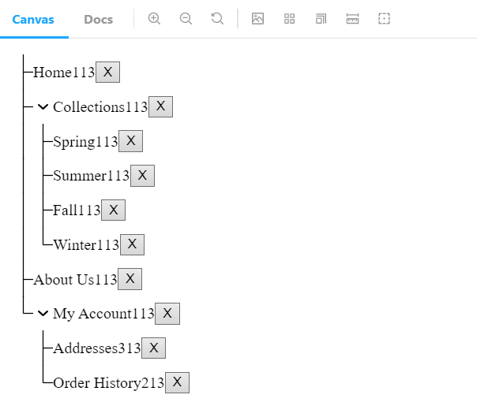

# dnd-kit-sortable-tree

[](https://www.npmjs.org/package/dnd-kit-sortable-tree) [](https://www.npmjs.org/package/dnd-kit-sortable-tree) [](https://opensource.org/licenses/MIT)

This is a Tree component extracted from [dndkit](https://github.com/clauderic/dnd-kit) examples and abstracted a bit.
Here's how it could look like (visuals are completely customizable via css though)
[](https://shaddix.github.io/dnd-kit-sortable-tree)

Play around in [examples](https://shaddix.github.io/dnd-kit-sortable-tree) to check the API and see what it can do.

## Install

    npm install dnd-kit-sortable-tree @dnd-kit/core @dnd-kit/sortable @dnd-kit/utilities

## How-to use

Check out the Storybook for code samples and play around. You could also play with it on [playcode](https://playcode.io/1032571)

Shortly, you need to render:

```tsx
<SortableTree
  items={/* array of your tree items */}
  onItemsChanged={/* callback when items are reordered */}
  TreeItemComponent={/* component that renders a single tree item */}
/>
```

And `TreeItemComponent` is usually your data wrapped in `SimpleTreeItemWrapper` or `FolderTreeItemWrapper`:

```tsx
React.forwardRef((props, ref) => (
  <SimpleTreeItemWrapper {...props} ref={ref}>
    <div>{props.item.value}</div>
  </SimpleTreeItemWrapper>
));
```

Note that wrapping in `forwardRef` and passing `ref` to `SimpleTreeItemWrapper` is very important!

## Examples

1. Here's the very minimal code to add a Sortable Tree. You shouldn't use it as is in your project, but it could be easier to grasp what's going on.
   ```jsx
   export const Minimal = () => {
     const [items, setItems] = useState(initialMinimalData);
     return (
       <SortableTree
         items={items}
         onItemsChanged={setItems}
         {
           /*
            * You need to pass the component rendering a single item via TreeItemComponent props.
            * This component will receive the data via `props.item`.
            * In this example we inline the component, but in reality you should extract it into a const.
            */ ...{}
         }
         TreeItemComponent={React.forwardRef((props, ref) => (
           <SimpleTreeItemWrapper {...props} ref={ref}>
             {/* HERE GOES THE ACTUAL CONTENT OF YOUR COMPONENT */}
             <div>{props.item.id}</div>
           </SimpleTreeItemWrapper>
         ))}
       />
     );
   };
   /*
    * Configure the tree data.
    */
   const initialMinimalData = [
     { id: '1', children: [{ id: '4' }, { id: '5' }] },
     { id: '2' },
     { id: '3' },
   ];
   ```
2. Here's the minimal viable example that you could potentially copy&paste to your project to start from.

   ```tsx
   export const MinimalViable = () => {
     const [items, setItems] = useState(initialViableMinimalData);
     return (
       <SortableTree
         items={items}
         onItemsChanged={setItems}
         TreeItemComponent={MinimalTreeItemComponent}
       />
     );
   };
   type MinimalTreeItemData = {
     value: string;
   };
   /*
    * Here's the component that will render a single row of your tree
    */
   const MinimalTreeItemComponent = React.forwardRef<
     HTMLDivElement,
     TreeItemComponentProps<MinimalTreeItemData>
   >((props, ref) => (
     /* you could also use FolderTreeItemWrapper if you want to show vertical lines.  */
     <SimpleTreeItemWrapper {...props} ref={ref}>
       <div>{props.item.value}</div>
     </SimpleTreeItemWrapper>
   ));

   /*
    * Configure the tree data.
    */
   const initialViableMinimalData: TreeItems<MinimalTreeItemData> = [
     {
       id: '1',
       value: 'Jane',
       children: [
         { id: '4', value: 'John' },
         { id: '5', value: 'Sally' },
       ],
     },
     { id: '2', value: 'Fred', children: [{ id: '6', value: 'Eugene' }] },
     { id: '3', value: 'Helen', canHaveChildren: false },
   ];
   ```

## API

### Data configuration (each TreeItem element could define them):

- `canHaveChildren` - Default: `true`.

  If set to `false`, prevents any node from being dragged into the current one.

  Also accepts a function: `(dragItem) => bool` which could conditionally determine if a certain item could be a children of a node

- `disableSorting` - Default: `false`. If set to `true`, prevents node from being dragged (i.e. it can't be sorted or moved to another node)

### Tree configuration (props of `<SortableTree>`)

- `items` - _mandatory_, items shown in a tree
- `onItemsChanged` - _mandatory_, callback that is called when dragging of certain item is finished. You should preserve new state and adjust the value of `items` prop as needed.
- `TreeItemComponent` - _mandatory_, component that renders a single tree row.
- `indentationWidth` - _optional_, padding used for children
- `pointerSensorOptions` - _optional_, configures the condition when item dragging starts. Defaults to:

  ```json
  {
    "activationConstraint": {
      "distance": 3
    }
  }
  ```

- `disableSorting` - _optional_, you could set this to `true` to completely disable the sorting
- `keepGhostInPlace` - _optional_, you could set this to `true` to keep the Node that you are dragging in it's original place in a Tree. Check [VSCode](https://shaddix.github.io/dnd-kit-sortable-tree/?path=/story/simple--vs-code-like) sample to see it in action.
- `dndContextProps` - _optional_, override any prop of underlying [DndContext](https://docs.dndkit.com/api-documentation/context-provider#props).
- `sortableProps` - _optional_, override any prop that is passed to underlying [useSortable](https://docs.dndkit.com/presets/sortable/usesortable) hook.

### TreeItemWrapper configuration (props of `<SimpleTreeItemWrapper>` and `<FolderTreeItemWrapper>`)

- `manualDrag` - Default: `false`. Set to `true` if you want tree item to be draggable ONLY from dragHandle.
- `showDragHandle` - _optional_, set to `false` if you want to hide default dragHandle and show your own instead. Use `<div {...props.handleProps}>DRAG_ME</div>` for your own drag handle.

# FAQ

1. If you want to [disable animation completely](https://shaddix.github.io/dnd-kit-sortable-tree/?path=/story/simple--no-drop-animation), you need to do the following:
   1. Pass `null` as `dropAnimation` prop (this disables the actual 'drop' animation for the Node that was dragged).
   1. Pass `{ animateLayoutChanges: () => false }` to `sortableProps` (this disables the animation of all other nodes that were not dragged)

# Troubleshooting

1. If your dragged item is shown at the end of a list, make sure you that:
   1. You wrapped your `TreeItem` component in `React.forwardRef` and passing the `ref` to `SimpleTreeItemWrapper`
   1. You pass the `styles` prop from `TreeItem` to `SimpleTreeItemWrapper`
